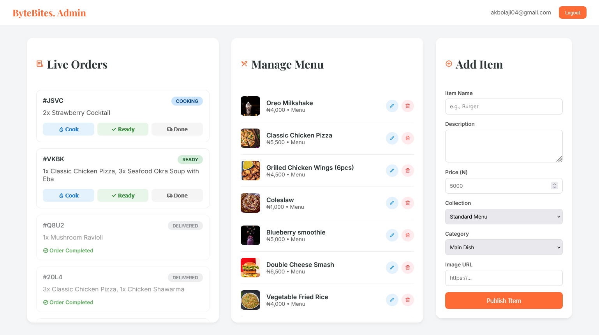

# 🍔 ByteBites

A food ordering app with live kitchen updates — built to handle what happens *after* the order is placed.

🔴 Live Demo: (https://bytebites.netlify.app/)

---

## Why I built this
Most food-delivery demos stop at “add to cart and checkout.”
I wanted to go deeper — what happens in the kitchen once an order lands?

ByteBites was my attempt to model a real flow:
- customer places an order
- kitchen sees it instantly
- order moves through clear states until delivery

No refresh buttons. No fake delays.

---

## What this project focuses on
- Real-time updates: Orders appear in the admin dashboard immediately using Firestore listeners.
- Two user roles, one app: Customers and admins see completely different interfaces from the same codebase.
- State that survives reloads: Cart data and sessions persist even if the browser is closed.

---

## Tech stack
- Frontend: Vanilla JavaScript (ES6+), CSS (Grid, Flexbox, CSS variables)
- Backend: Firebase (Auth, Firestore, Storage)
- Structure: A lightweight MVC-style setup using ES modules

I intentionally avoided frameworks here to strengthen my core JavaScript and DOM skills.

---

## Features

### Customer side
- Google and email/password authentication
- Persistent cart using LocalStorage
- Light/Dark mode with system preference support

### Admin / kitchen dashboard
- Live order board powered by Firestore `onSnapshot`
- Order status flow: Cooking → Ready → Delivered
- Menu management with full CRUD operations

---

## Screenshots
### Customer Menu

### Admin Dashboard

---

## What I learned
- When real-time matters: `onSnapshot` is a better fit than traditional fetch calls for dashboards that need instant updates.
- DOM performance: Managing UI updates without a framework forced me to be deliberate about event delegation and re-renders.
- Access control: I implemented basic role-based logic to pr
